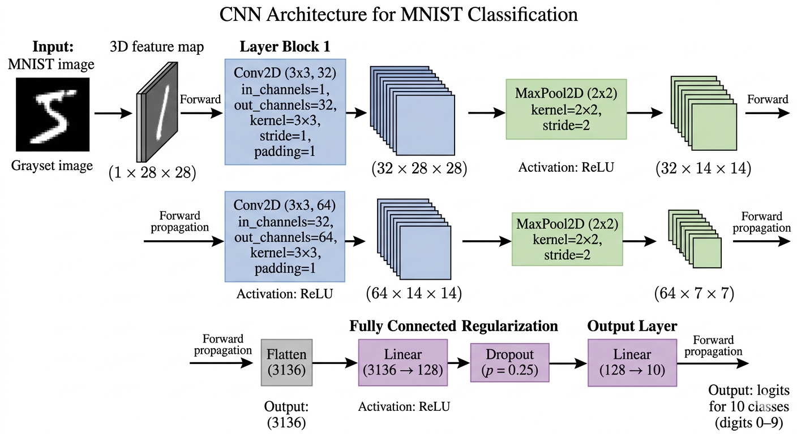
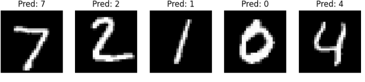

# MNIST Digit Classifier

A Convolutional Neural Network (CNN) built with PyTorch for handwritten digit classification on the MNIST dataset. The project follows a modular structure with separate components for data processing, model definition, training, evaluation, and visualization, making it easy to experiment with and extend.

---

## Overview

The MNIST dataset is a standard benchmark for image classification. This project implements a CNN that learns to recognize handwritten digits (0–9) and achieves **99.26% test accuracy** while maintaining a simple and reproducible training pipeline.

---

## Features

- CNN-based image classifier
- Modular project structure
- Automatic MNIST dataset download
- GPU acceleration when available
- Model evaluation utilities
- Prediction visualization
- Cross-platform execution
- Approximately **99.26%** test accuracy

---

## Model Architecture

The network consists of two convolutional blocks followed by two fully connected layers with dropout for regularization.

<p align="center">
  
</p>

### Architecture

| Layer | Output |
|--------|--------|
| Input | 1 × 28 × 28 |
| Conv2D (32 filters, 3×3) | 32 × 28 × 28 |
| ReLU | — |
| Max Pooling | 32 × 14 × 14 |
| Conv2D (64 filters, 3×3) | 64 × 14 × 14 |
| ReLU | — |
| Max Pooling | 64 × 7 × 7 |
| Flatten | 3136 |
| Fully Connected | 128 |
| Dropout | 0.25 |
| Output Layer | 10 Classes |

---

## Results

The model converges quickly and performs well on the MNIST test dataset.

<p align="center">
  
</p>

| Metric | Value |
|--------|------:|
| Test Accuracy | **99.26%** |
| Final Training Loss | ~0.026 |
| Training Epochs | 5 |

---

## Project Structure

```
mnist-digit-classifier/
│
├── configs/              # Hyperparameters
├── notebooks/            # Experiments
├── outputs/              # Saved models
├── scripts/              # Training scripts
│
├── src/
│   ├── data/             # Data loading
│   ├── evaluation/       # Evaluation
│   ├── models/           # CNN model
│   ├── training/         # Training pipeline
│   └── utils/            # Visualization
│
├── requirements.txt
└── README.md
```

---

## Installation

Clone the repository:

```
git clone https://github.com/gopal092003/MNIST-digit-classifier.git

cd MNIST-digit-classifier
```

Install the required packages:

```
pip install -r requirements.txt
```

---

## Training

Run the training pipeline:

```
python -m src.training.train
```

Alternatively,

**Linux / macOS**

```
 scripts/train.sh
```

**Windows**

```
python src/training/train.py
```

---

## Evaluation

Evaluate the trained model:

```
python -m src.evaluation.evaluate
```

Example output:

```
Test Accuracy: 99.26%
```

---

## Sample Predictions

The trained model is capable of:

- Classifying handwritten digits from 0–9
- Generalizing to different handwriting styles
- Producing high-confidence predictions on unseen data

---

## Tech Stack

- Python
- PyTorch
- Torchvision
- Matplotlib

---

## Future Improvements

- Confusion matrix visualization
- Precision, Recall, and F1-score
- Grad-CAM explainability
- Hyperparameter optimization
- Streamlit web application
- Model export with ONNX or TorchScript

---

## Notes

- The MNIST dataset is downloaded automatically.
- CUDA is used automatically when a compatible GPU is available.
- The modular project structure makes it straightforward to experiment with different architectures.

---

## Author

**Gopal Gupta**

GitHub: https://github.com/gopal092003

---

## License

This project is licensed under the MIT License.
